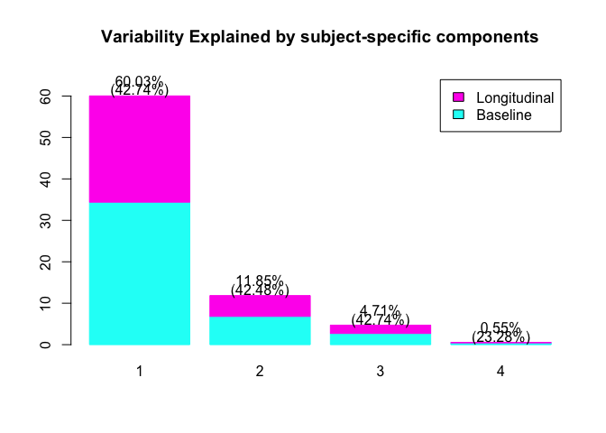
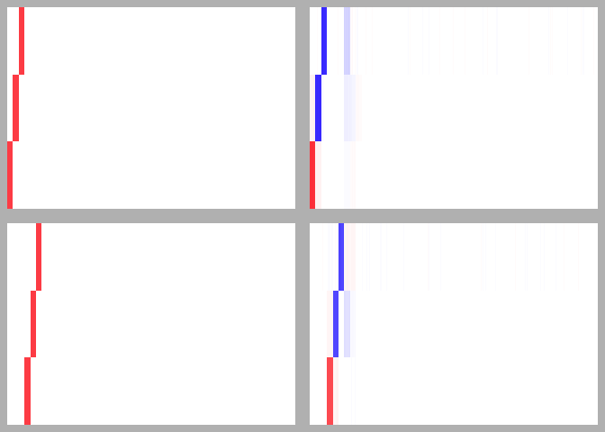

<!-- README.md is generated from README.Rmd. Please edit that file -->

HDLFPCA
=======

<!-- badges: start -->

<!-- badges: end -->

The goal of HDLFPCA is to Perform High-dimensional Longitudinal PCA.

Installation
------------

You can install the development version from
[GitHub](https://github.com/) with:

    # install.packages("devtools")
    devtools::install_github("seonjoo/HDLFPCA")

Usage
-----

    library(HDLFPCA)
    example_hd_data = generate_hd_data(I = 100)
    phix0 = example_hd_data$phix0
    phix1 = example_hd_data$phix1
    phiw = example_hd_data$phiw
    Y = example_hd_data$Y
    time = example_hd_data$time
    J = example_hd_data$J
    I = example_hd_data$I
    visit = example_hd_data$visit
    re <- hd_lfpca(
        Y,
        T = scale(time, center = TRUE, scale = TRUE),
        J = J,
        I = I,
        visit = visit,
        varthresh = 0.95,
        projectthresh = 1,
        timeadjust = FALSE,
        figure = TRUE
      )
    #> Reduce Dimension
    #> Estimate Covariance Functions
    #> Calcuate Scores
    #> Compute Residual to the Demeaned Data.
    #> Residual of LFPCA Model is: 9872.67284871758

    cor(phix0, re$phix0)
    #>             [,1]        [,2]        [,3]        [,4]
    #> [1,]  0.99720326  0.09083731  0.02831191 -0.03210385
    #> [2,]  0.04360455 -0.99192254  0.03077443  0.07037896
    #> [3,] -0.02504620  0.01250388 -0.97917094  0.11347137
    cor(phix1, re$phix1)
    #>             [,1]        [,2]         [,3]       [,4]
    #> [1,]  0.99755948  0.08022781 -0.001390277 0.12272830
    #> [2,]  0.04494263 -0.98371159  0.029040865 0.05042425
    #> [3,] -0.02278886  0.01911020 -0.993862522 0.07308564

    library(gplots)
    #> 
    #> Attaching package: 'gplots'
    #> The following object is masked from 'package:stats':
    #> 
    #>     lowess
    par(mfrow = c(2, 2),
        mar = rep(0.5, 4),
        bg = "gray")
    bs = c(-100:100) / 1000 * 1.5

    image(phix0,
          axes = FALSE,
          col = gplots::bluered(200),
          breaks = bs)
    image(re$phix0[, 1:3],
          axes = FALSE,
          col = gplots::bluered(200),
          breaks = bs)
    image(phix1,
          axes = FALSE,
          col = gplots::bluered(200),
          breaks = bs)
    image(re$phix1[, 1:3],
          axes = FALSE,
          col = gplots::bluered(200),
          breaks = bs)

